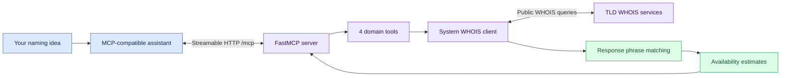
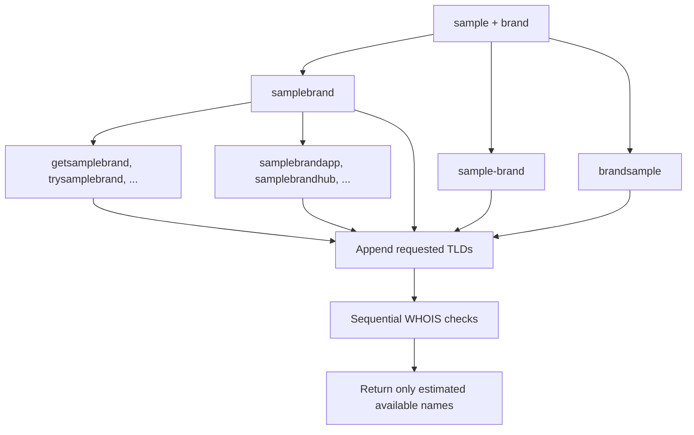

# Domain Check MCP

**From an idea to a domain shortlist, inside your AI workflow.**


Give an MCP-compatible assistant four tools to check domains, compare extensions,
and explore keyword-based names. A lightweight Python server connects the
assistant to public WHOIS services through FastMCP and Streamable HTTP.

**No registrar account. No API key. No database.**

> [!IMPORTANT]
> WHOIS availability is a heuristic, not a registration guarantee. Always confirm
> your shortlist with a registrar. No live availability claims are made in the
> examples below.

[Quick start](#quick-start) · [Use cases](#use-cases) ·
[How it works](#how-it-works) · [Tool reference](#tool-reference) ·
[Rate limits](#rate-limits-and-request-budget) · [Limitations](#limitations) ·
[Security and privacy](#security-and-privacy)

## Use cases

| Your goal | What the assistant can do | Tool |
|-----------|--------------------------|------|
| Name a new project | Explore joined, hyphenated, prefixed, and suffixed keyword variations | `suggest_domains` |
| Compare extensions | Check the same name across your preferred TLDs | `check_name_across_tlds` |
| Review a shortlist | Check a supplied list while preserving input order | `check_domains_bulk` |
| Check one candidate | Return a single availability estimate | `check_domain` |

### Try these prompts

Once your assistant is connected to the server:

> "Check whether `example.com` is available."

> "Compare the name `samplebrand` across `.com`, `.net`, and `.org`."

> "Suggest names from `sample` and `brand`, checking only `.com` and `.net`."

> "Check this shortlist and separate available, taken, and timed-out results."

The assistant chooses and invokes the tools; the server performs the WHOIS
checks. It does not buy domains, reserve names, or assess trademarks.

## How it works



### From keywords to candidates

For `["sample", "brand"]`, the suggestion tool builds variations like these
before checking each requested TLD:



Prefixes: `get`, `try`, `use`, `go`, `my`, `the`.
Suffixes: `app`, `hub`, `lab`, `hq`, `ly`, `ify`.
Reversal uses the first two keywords when at least two are supplied.

## Quick start

### Docker

```sh
git clone https://github.com/gil906/Domain-Check-MCP.git
cd Domain-Check-MCP
docker build -t domain-check-mcp .
docker run --rm --name domain-check-mcp \
  -p 127.0.0.1:8083:8083 domain-check-mcp
```

Connect an MCP client to `http://127.0.0.1:8083/mcp`. This is an MCP protocol
endpoint, not a REST API or a web interface.

In your client's MCP server settings, select **Streamable HTTP** and enter that
URL. Configuration syntax varies by client. If the client runs in another
container or on another machine, its `127.0.0.1` is not this server; use a
reachable address behind appropriate access controls.

WHOIS queries require outbound network access, normally TCP port 43.

<details>
<summary><strong>Prefer running Python directly?</strong></summary>

Use Python 3.11 and install the system `whois` utility. On Debian or Ubuntu:

```sh
sudo apt-get update
sudo apt-get install whois ca-certificates
python3 -m venv .venv
. .venv/bin/activate
pip install -r requirements.txt
python mcp_domain_check.py
```

**Direct Python execution binds to all interfaces**, unlike the loopback-only
Docker port mapping above. Restrict access before starting it.

</details>

## Tool reference

| Tool | Arguments | Result |
|------|-----------|--------|
| `check_domain` | `domain: str` | One availability result |
| `check_domains_bulk` | `domains: list[str]` | Results for the supplied domains |
| `check_name_across_tlds` | `name: str`, optional `tlds: list[str]` | Results for a base name across TLDs |
| `suggest_domains` | `keywords: list[str]`, optional `tlds: list[str]` | Available keyword variations |

Across-TLD checks default to `com`, `net`, `org`, `io`, `co`, `dev`, `app`,
`ai`, `me`, and `xyz`. Suggestions default to `com`, `io`, `dev`, and `co`.
Pass an explicit TLD list to limit queries; an empty list performs no checks.

### Example tool arguments

These are **tool argument objects**, not standalone HTTP requests:

```json
{
  "name": "samplebrand",
  "tlds": ["com", "net", "org"]
}
```

Pass the object above to `check_name_across_tlds`. For `suggest_domains`:

```json
{
  "keywords": ["sample", "brand"],
  "tlds": ["com", "net"]
}
```

### Understand the results

Each result contains `domain`, `available`, and `status`. `available` is
`true` or `false`, or `null` on timeout. Illustrative output:

```json
{"domain": "example.com", "available": false, "status": "taken"}
```

| `available` | `status` | Interpretation |
|-------------|----------|----------------|
| `true` | `AVAILABLE` | WHOIS output matched an availability phrase |
| `false` | `taken` | No availability phrase matched; lookup errors can also cause this |
| `null` | `timeout - try again` / `timeout` | Single / bulk lookup exceeded 10 seconds |

`suggest_domains` returns only results where `available` is `true`, so it does
not expose taken or timed-out candidates.

### TLD coverage

Explicit WHOIS server mappings exist for:

`com` · `net` · `org` · `io` · `co` · `dev` · `app` · `ai` · `me` · `xyz` ·
`tech` · `info` · `biz` · `us`

Other TLDs use the system WHOIS client's server selection. A mapping does not
guarantee that the registry currently accepts queries or uses a recognized
response format.

## Rate limits and request budget

**There is no configured application-level cap on MCP tool calls per second or
per minute.** This does not mean unlimited safe throughput: CPU, client
concurrency, network latency, and WHOIS provider policies constrain actual
capacity. The server does not provide a rate-limit queue, configurable quota,
automatic backoff, or a rate-limit-specific response.

| Layer | Requests per second | Requests per minute | Current behavior |
|-------|---------------------|---------------------|------------------|
| MCP tool calls | No configured cap | No configured cap | No application-level rate limiter |
| WHOIS lookups | No universal allowance | No universal allowance | Each registry applies its own policies |
| One bulk or suggestion call | Depends on lookup duration | Depends on lookup duration | Domains are checked one at a time within that call |

WHOIS limits can vary by registry, source IP, and time window. This project
does not establish a provider-approved numerical quota. A registry may throttle,
refuse, or block queries; the current parser can misreport these failures as
`taken`. A `taken` result is therefore not proof that a rate-limited query
succeeded.

### How many domain checks does one request trigger?

Count **domain lookups**, not just MCP tool calls. The system WHOIS client may
make additional network queries when following referrals.

| Tool call | Domain lookups |
|-----------|----------------|
| `check_domain` | 1 |
| `check_domains_bulk` | Number of supplied domains, including duplicates |
| `check_name_across_tlds` | Number of supplied TLDs; 10 by default |
| `suggest_domains` | Unique generated names multiplied by the number of supplied TLDs |

For `["sample", "brand"]`, suggestions generate **15 unique names**. With the
four default TLDs, **one tool call triggers 60 domain lookups**. With only
`["com"]`, it triggers 15. Other keyword inputs may generate fewer unique names
because candidates are deduplicated; repeated TLDs are not deduplicated.

### Illustrative throughput, not a quota or benchmark

For one sequential stream, ignoring overhead:

`lookups/second = 1 / average lookup duration in seconds`

`lookups/minute = 60 / average lookup duration in seconds`

| Assumed average lookup duration | Approximate lookups/second | Approximate lookups/minute | Time for 60 lookups |
|--------------------------------|----------------------------|----------------------------|---------------------|
| 0.5 seconds | 2 | 120 | 30 seconds |
| 1 second | 1 | 60 | 1 minute |
| 2 seconds | 0.5 | 30 | 2 minutes |
| 10 seconds, all timing out | 0.1 | 6 | About 10 minutes |

These are arithmetic examples, **not measured performance or permitted provider
rates**. The 10-second subprocess timeout is not a pacing delay or a global
rate limit. Overlapping tool calls can generate concurrent WHOIS traffic; the
server does not impose a shared global lookup budget.

For cautious use, start with **one outstanding tool call**, small shortlists,
and one or two TLDs. Honor the relevant provider's published policy and avoid
immediate repeated retries after timeouts or suspected throttling. If you need
a hard requests-per-second or requests-per-minute cap, enforce it in your
client or an authenticated gateway; an MCP call cap alone does not cap the
number of WHOIS lookups generated by each call.

## Limitations

Availability is a **heuristic, not a registration guarantee**. The server
matches phrases in WHOIS output; unsupported servers, rate limits, connection
errors, or changed response formats can incorrectly report a domain as taken.
In particular, `.app`, `.dev`, and `.co` results can be unreliable. Confirm any
result with a registrar before making registration decisions.

Queries run sequentially within each bulk or suggestion call, with a 10-second
timeout per domain. Suggestions can take several minutes and their order is
not stable. They omit unavailable and timed-out results. Inputs are not
normalized or validated; provide plain domain names and TLDs, not URLs or WHOIS
options.

There is no caching, RDAP fallback, registrar integration, or application-level
rate limiting. Narrow the TLD list and keep batches small to reduce lookup time
and avoid overwhelming registry services.

## Security and privacy

> [!WARNING]
> The application listens on `0.0.0.0:8083` and has **no built-in authentication**.
> Do not expose it directly to the public internet. Use the loopback-only Docker
> example, a firewall, or an authenticated reverse proxy.

The server requires no credentials or personal configuration and implements no
database or lookup-history storage. Queries do leave your machine: domain names
are sent to public WHOIS services, which may have their own logging policies.
Your MCP client, container runtime, or reverse proxy may also retain logs.

Do not submit confidential project names if that external disclosure is
unacceptable. Keep environment files, credentials, logs, and private deployment
configuration out of Git; the repository includes `.gitignore` and
`.dockerignore` exclusions for common sensitive files.

## Tests

Tests mock WHOIS responses and require no network access:

```sh
python -m unittest -v
```

Or run them in the built image:

```sh
docker run --rm --network none \
  -v "$PWD/test_domain_check.py:/app/test_domain_check.py:ro" \
  domain-check-mcp python -m unittest -v
```

The tests cover registry selection, availability parsing, timeouts, bulk
ordering, TLD selection, and suggestion filtering. They check implementation
behavior, not real-time registry availability.

<details>
<summary><strong>Troubleshooting</strong></summary>

| Symptom | What to check |
|---------|---------------|
| Client cannot connect | Container is running, port `8083` is reachable, and URL ends with `/mcp` |
| Browser GET does not show results | Use an MCP client; the endpoint is not a web UI |
| Every candidate appears taken | Outbound TCP `43`, registry throttling, and WHOIS response compatibility |
| Suggestions take a long time | Checks are sequential; request fewer TLDs or check a small shortlist |
| Python cannot find `whois` | Install the system WHOIS package or use Docker |

</details>
